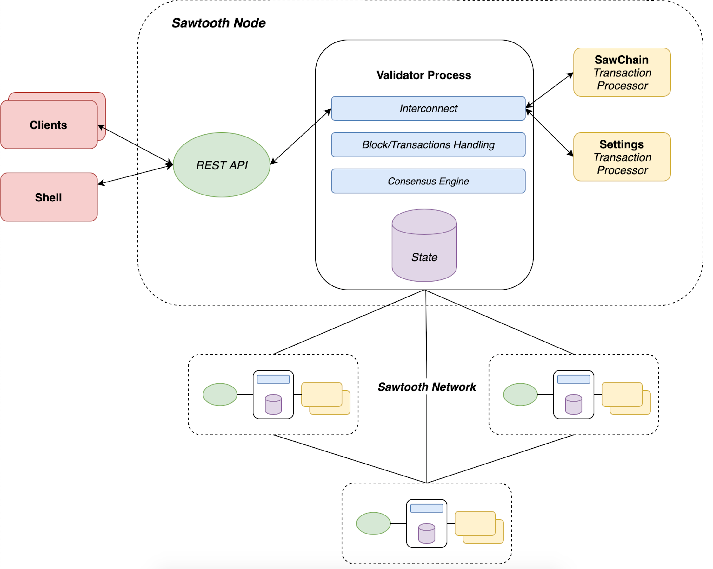

# SawChain
SawChain is a distributed application designed for improving food supply-chain management through blockchain technology.
It enables different parties to rely on a unique source of information and trust along the entire supply-chain. 
Smart contract technology makes possible to perform sales of products, backtracking of events and non-anonymity of recordings.
A consortium can make up the whole configuration of the system using a customizable set of users and types in order to match their specific needs.
The benefits of SawChain are equally distributed from supply-chain stakeholders to external individuals. The security of data relies
on a transaction ledger which mitigates the lack of trust and transparency, satisfying the high-demand of information availability and integrity requested by customers.

## Contents
- [Why Hyperledger Sawtooth](#why-hyperledger-sawtooth)
- [Architecture](#architecture)
- [Getting Started](#getting-started)
    * [Requirements](#requirements)
    * [How to start a Sawtooth Node](#how-to-start-a-sawtooth-node)
    * [How to test the SawChain TP](#how-to-test-the-sawchain-tp)
- [Contributions](#contributions)
- [License](#license)

# Why Hyperledger Sawtooth
SawChain is designed to achieve data integrity and availability through a unique source of information between mutually-untrusted parties.
The food supply-chain management involves different kind of parties, such as industries, certification authorities, customers and operators. 
To guarantee interoperability with regulators a *permissioned-blockchain* seems to be the best fit because forbids the write permission to unauthorized individuals.
SawChain is based on [Hyperledger Sawtooth](https://www.hyperledger.org/projects/sawtooth) which gives an high-degree of customization, scalability and user permissions.
Taking advantage from the core features of Sawtooth, a generic customizable infrastructure for users, types, products and events is defined.
The system startup is made by an external peer who acts as a system administrator and allows every authorized operator to execute I/O operations on batches of products.
Each record has to pass through time and quantity constraints that aims to mitigate the introduction of un-tracked products and to reduce error rate of the users. 
Certification and control authorities are enabled to record a unique document fingerprint (hash) for their product certifications of quality.
The huge volume of IoT transactions is easily handled exploiting the high-scalability of Sawtooth.

# Architecture 


Running alongside the core components from Hyperledger Sawtooth, SawChain provides the smart contract (or Transaction Processor (TP) in Sawtooth jargon)
responsible for the entire supply-chain application logic. Each component will run in an individual "container" using [Docker](https://www.docker.com/products/container-runtime).
The project main directory includes a [docker-compose](docker-compose.yaml) file that contains the instructions for Docker to make up multiple components and network them together. 
The core pre-packaged Sawtooth components are downloaded from [DockerHub](https://hub.docker.com/search/?q=sawtooth&type=image).

### Components
This table reports the endpoint connection, the download source and a short description for each component sketched in the architecture overview. 

| Name                   | Endpoint              | Source    | Description
| ---------------------- | --------------------- | --------- | ------------------------
| validator              | tcp://localhost:4004  | DockerHub | Validates blocks and transactions.
| rest-api               | http://localhost:8008 | DockerHub | Provides blockchain via HTTP/JSON.
| sawchain-processor     | --                    | custom    | The whole food supply-chain application logic.
| shell                  | --                    | DockerHub | Environment for running Sawtooth commands.
| settings-tp            | --                    | DockerHub | Built-in Sawtooth transaction processor.

# Getting Started
This project use Docker to simplify dependencies and deployment.
After cloning this repo, follow the instructions specific to your OS to install and run whatever components are required 
to use `docker` and `docker-compose` from your command line. 
This is the only dependency required to run SawChain components because Docker takes care of each component.
If you would like to locally test the SawChain TP functionalities without downloading and running every Docker container, you need to follow the instructions specific 
to your OS to install and run [NodeJS](https://nodejs.org/en/download/).
The [JavaScript SDK](https://github.com/hyperledger/sawtooth-sdk-javascript) it is the most consistent Sawtooth SDK and has been used to define the entire SawChain TP.
The TDD process it was performed using both [Mocha](https://github.com/mochajs/mocha) and [Chai](https://github.com/chaijs/chai) libraries.

In case that you're in troubles with [Docker](https://www.docker.com/sites/default/files/d8/2019-09/docker-cheat-sheet.pdf) or [Sawtooth](https://sawtooth.hyperledger.org/docs/core/releases/latest/introduction.html).

## Requirements
You need to have installed:
- NodeJS >= 12.13.0
- Docker >= 19.03.5
- Docker Compose >= 1.24.1

## How to start a Sawtooth node
Once Docker is installed and you've cloned this repo, navigate to the root project directory and run

```
docker-compose up
```

The first attempt it might take a while because Docker needs to download each required image from DockerHub.
However, when complete will be running all required components in separate containers.
Many of the components will be available through HTTP endpoints as reported in [table](#components).

In bash you can shutdown these components with the key combination `ctrl-C`. 
You can shutdown and remove the containers (destroying their data), with the command

```
docker-compose down
```

Finally, the Sawtooth Node is locally deployed and ready to be called through the REST APIs.

## How to test the SawChain TP
To speed up the TDD process, a series of wrapper classes for Sawtooth context, transactions and handler features has been defined.
These can be used for testing the SawChain TP features without downloading and running every Docker component.
From root folder, follow these instructions to run every test defined during the development of SawChain TP.

```
cd /processor
npm i
npm run test
```

# Contributions
Keep in mind that this work is a Proof of Concept (PoC) application. The project guidelines are defined according to a previous study which aim was to strengthened 
food supply-chains with blockchain technology ([paper](https://bit.ly/36OYrvn)).
The repo contains the definition of each state entity, the TP logic and its tests as reported in the paper. 
If you would like to interact with the blockchain, you can use simple calls to Sawtooth's standard REST API module from any type of client.

This project is NOT production ready by any means. 

You are most warmly invited to play around with the repo.

# License
SawChain is under the MIT software license. 

Check [LICENSE](https://github.com/Jeeiii/SawChain/blob/master/LICENSE) for more information.
